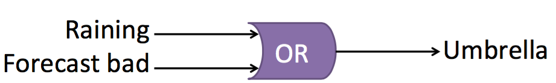
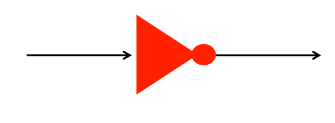
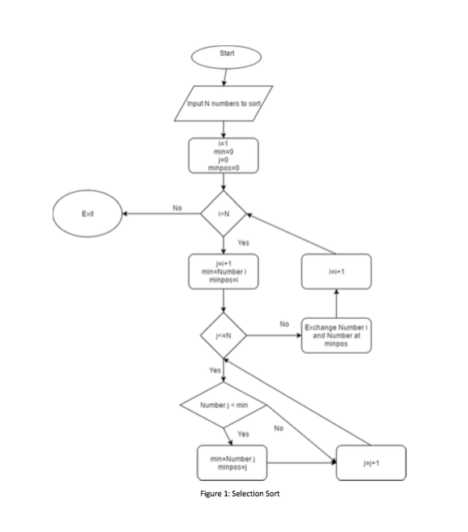

## Lab 1 - January 10th, 2017

### Databases and SqLite

How we access data is we use these things called queries. 

In the terminal type in:

```bash
sqlite3

and then

.read FILENAME.sql

and then

select * from characters;
```

Order matters when running `select` in the terminal from the database. It is not case sensitive.

**Ex.** You can use FROM, ChaRacters, Select, ect. 

`select dinstinct` Applies only to what follows, and makes it so only unique data gets return. 
 
 ```sql
 select distinct title from characters;
 ``` 

**Notes:** You can have an or in your where.

```sql
 select * from characters where title = 'Horton Hears a Who' or title = 'Horton Hatches the Egg';
```
 
**Ex.** You can order your return. 
 
 ```sql
 select name, year from characters order by year, title;
 ```
 
### Aggregate function

* count
* max
* min
* avg

## Lab 2 - January 17th, 2017

### Flowcharts

* Rounded Rectangle -> Start and Stop
* Rectangle -> Process
* Diamond -> Decision
	* Yes or No
* Italic Rectangle -> Data Input or Output

### Communicate an algorithm 

* Easy 
* Visual
* Simple for hard problems

### Criteria for lab assignment 

* Flowchart: 
    * Draw by hand **or** 
    * Draw with https://draw.io

#### You should know how to: 

* Convert Pseudocode to Flowchart and Flowchart to Pseudocode

**Lab Exercise:** Draw a flowchart for playing 1 turn of "computer pictionary"

* 2 teams (Team A and B)
* Only using names of movies
* Computer draws movie name (if it can)
* 5 guesses

N.B. Team A draws a name -> Team A inputs name into computer -> Team B guesses (Max. 5 times)

**My Solution:**


**Group Solution:**


**PseudoCode Exercise:** Get the name and title of books where there is a 1 and the year in lesser than 1960

Table 1: Characters

| name     | title    | year | human |
| --------:| --------:| ----:| -----:|
| example  | example  | 1983 | 1     |
| example2 | example2 | 1924 | 0     |
| example3 | example3 | 1999 | 1     |

Answer:  `Select name, title from characters where human=1 and year<1960`

## Lab 3 - January 24th, 2017

### Hex to Binary To Decimal

| Dec | Hex | Binary |
| ---:| ---:| ------:|
|    0|    0|    0000|
|    1|    1|    0001|
|    2|    2|    0010|
|    3|    3|    0011|
|    4|    4|    0100|
|   10|    A|    1010|
|   11|    B|    1011|
|   12|    C|    1100|
|   13|    D|    1101|
|   14|    E|    1110|
|   15|    F|    1111|

### Binary to Hex

|0010|1101|1111|
|---:|---:|---:|
|   2|   D|   F|

### Hex to Dec

|    2|     D|     F|
|----:|-----:|-----:|
|16(2)| 16(1)| 16(0)|

= Big Number

### 2's compliment

**Note:** Number of bits need to be even

**Ex:** Positive number in 2's complement

+28 = 28 in binary

## Lab 4 - January 31st, 2017

* OR (+)

* And (*)
  
* XOR (circleX)
* Not (~)


Truth Tables -> Circuit Diagram 

A) Draw a diagram of an OR gate using only AND and NOT gates. 

B) Draw a circuit diagram for an AND gate using only OR and NOT gates.

#### The "OR and ANDS" Rule
OR, AND, NOT gates

|A   |B   |C   |
| --:| --:| --:|
|0   |0   |0   |
|0   |1   |1   |
|1   |0   |0   |
|1   |1   |1   |

1. Look at only to inputs with 1 output. 
2. A is 0 -> Not gate
3. B is 1 -> Nothing
4. an AND those two
5. A is 1 -> Nothing
6. B is 1 -> Nothing
7. and AND those two
8. put both those paths to an OR gate

---

**Note:** Doing AND for two inputs and then AND that input with a third input is the same as AND for three inputs. 

## Lab 5 - February 7th, 2017

#### Sorting

Selection Sort vs. Bubble Sort

**Selection Sort**

List of numbers [64, 25, 12, 22, 11]

```
n=5
min position = "position of min"
min = "min for index i"
i = "index for next sorted number"
j = "index to compare as next min"

1. Look at index 1
2. Find the lowest number in the list and switch it with the first position.

[11, 25, 12, 22, 64]

1. Look at index 2
2. Find the new min
3. Is the number lower than that of index 2

[11, 12, 25, 22, 64]

ect. 

[11, 12, 22, 25, 64]

1. Look at the last two in the array
```




**Bubble Sort**

List of numbers [5, 1, 4, 2, 8]

```
n=5
i = N
j = ""

```


Wikipedia page on bubble sort

## Lab 6 - February 21st, 2017

#### Human Computer Interaction

* Sign into LINUX, open chrome
* https://webdemo.balsamiq.com
* Prototype

## Lab 7 - February 28th, 2017

#### Python Basics

In terminal: 

* cd Desktop
* python python_basics.py

Basics 

* `# comment` 
* `print "Hello World!"`
* Dynamically typed
* `def - Function`

```python 
#Function
def functionName (paramaters):
    code
    return
``` 

* Code is linear 
* For Loops

```python 
for counter in range(start num, end num, stepsize):
```

## Lab 8 - February 7th, 2017

https://www.tutorialspoint.com/codingground.htm

fortran (https://www.tutorialspoint.com/compile_fortran_online.php)

compile -> execute
Is statically typed
REAL is a decimal number
running the main program -> main in the terminal
. is making sure there is something on either side. 


```fortran
! Dominique Charlebois
! Fortran Basics

! Declaring variables
REAL X, Y, SUM

! Printing
PRINT *, 'Enter X:'

! Read Command
READ *, X

PRINT *, 'Enter Y:'

READ *, Y

IF ( X .GT. Y) GO TO 100
IF ( Y .GT. X) GO TO 200
IF ( Y .EQ. X) GO TO 300

! Needed
100 PRINT *, 'X > Y'
PRINT *, 'MAX = ', X
STOP
200 PRINT *, 'Y > X'
PRINT *, 'MAX = ', Y
STOP
300 PRINT *, 'Y = X'
STOP

END
```

C++
https://www.tutorialspoint.com/compile_cpp_online.php
compile -> execute
statically typed
return 0 -> this function returns an integer
cout -> print something arrows to the left is send out 
cin -> arrows to the right is send in

```c++
// Dominique Charlebois
// C++ Basics
#include <iostream>

using namespace std;

int main()
{
   cout << "Hello World" << endl; 
   
   int X = 5;
   int A = 3;
   X = X + 1;
   
   cout << "X = " << X << endl; 
   cout << "A = " << A << endl; 
   
   cout << "Enter a number: "; 
   int num1;
   cin >> num1;
   
   if (num1 > 5) {
       cout << num1 << " is greater than 5" << endl;
   } else {
      cout << num1 << " is less than 5" << endl; 
   }
   
   for (int i = num1; i >= 0; i--) {
       cout << i << endl;
   }
   
   cout << " Blast Off!" << endl;
   
   return 0;
}
```


go 
created by google
python and java
statically typed (Kindof)
execute

```go
// Domininque Charlebois
// Google Go Basics

package main

import "fmt"

func main() {
   fmt.Printf("hello, world\n")
   
   var hello string = "Hello World!"
   var a int = 3
   
   // More of dynamically typed
    x := 5
    fmt.Println(hello, a, x)
    
    var num int
    fmt.Print("Enter a number: ")
    // REading input from the command line, storing integer as num variable
    fmt.Scanf("%d", &num)
    
    if num > x {
        fmt.Println(num, " is larger than 5")
    } else if num < x {
        fmt.Println(num, " is lesser than 5")
    } else {
        // Enter this code block only when num entered is = 5
        fmt.Println(num, " is equal to 5")
    }
    
    for i := 5; i > 0; i-- {
        // Execute Code
        fmt.Println(i)
        
    }
    
    fmt.Println("Blast Off!")
}
```
