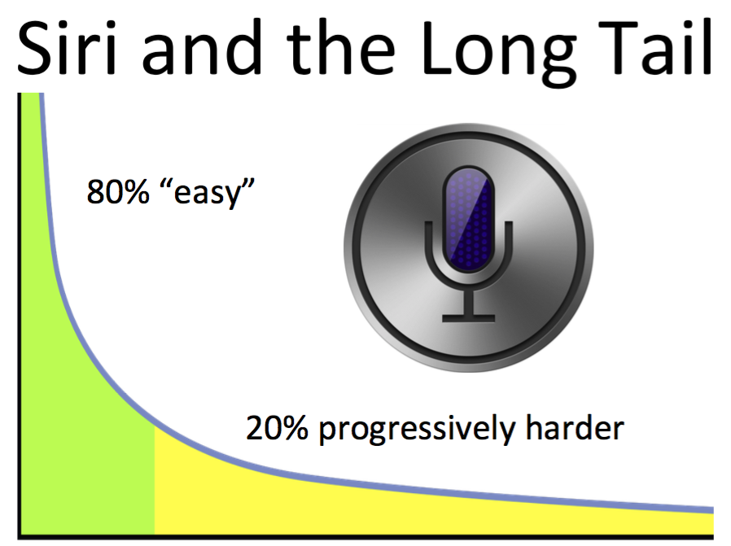
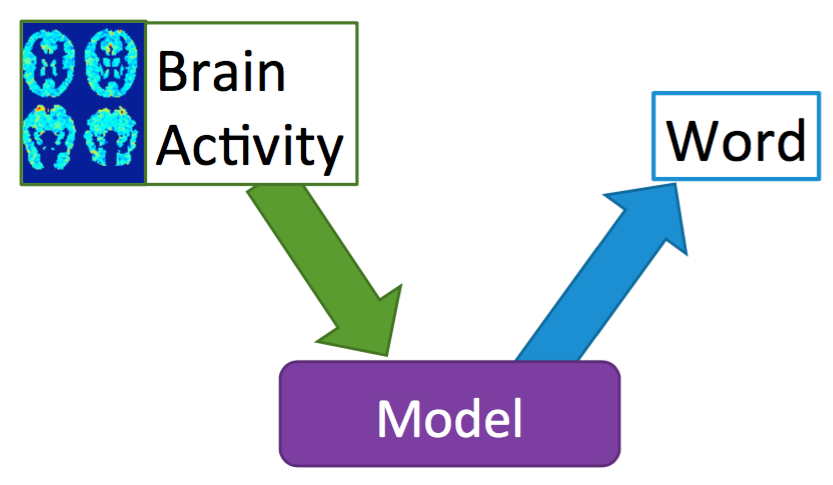
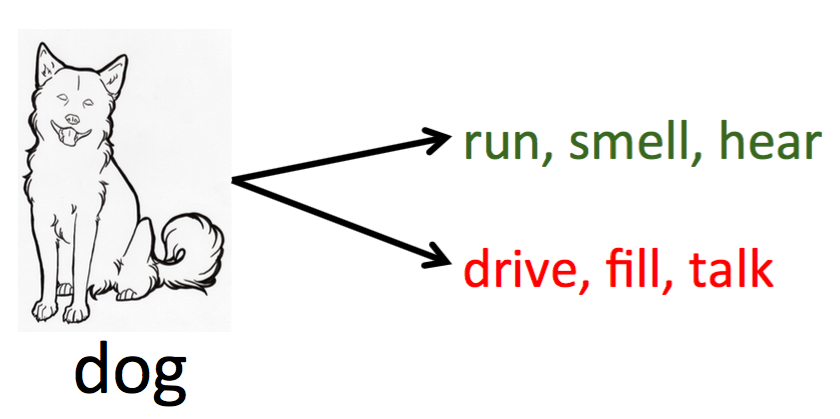

## Lecture 16 - February 10th, 2017

My research question: 

**How doees the brain encode (represent) the meaning of words? How does it combine word meaning to represent more complex concepts?**

Siri and the Long tail:

 

#### Outline

* Brain imaging
* Word meaning in the brain 
* Words in context

Brain imaging technology:

* Functional Magnetic Resonance Imaging (fMRI)
    * Measuers changes in blood oxygenation (BOLD)
        * Good spatial resolution
        * Poor time resolution
* MEG  
    * Magnetoecephalography (magnet / brain / graph)
    * Magneted sheeted room -> because earth
        * 102 sensor position
        * 3 sensors / position
        * Poorer spatial resolution than fMRI
        * Great time resolution
        * Great for language studies
    
    
Meaning in the brain:

* What would it mean to have a model of meaning representation in the brain?
    * Which brain areas acKvate for parKcular words
    * Predict the word a person is reading from their brain acKvaKon
    

How to build a model?

    Show a computer algorithm many examples.
    Training
    Find Patterns
    Test

    Predict unseen words
    Find Patterns
    
    You can't build model for every word
        Solution: Word Features (eg. edible, alive)
    

**Ex. The Brain Data**

* 9 subjects fMRI , 9 subjecy MEG
* 60 concrete noun w/ pictures

Word Features

**Co-occurence with verbs: (MRI)**

* Accuracy: 77%

**20 Questions: (MEG)** 

* Array of numbers = Identifier of the Word

* Visual Features (Of the Word and the Image)
    * Posterior Regions 
        * Detected in 150ms-250ms
* Word Meaning
    * Distrubuted throughout the brain 
        * Detected in 200-600ms