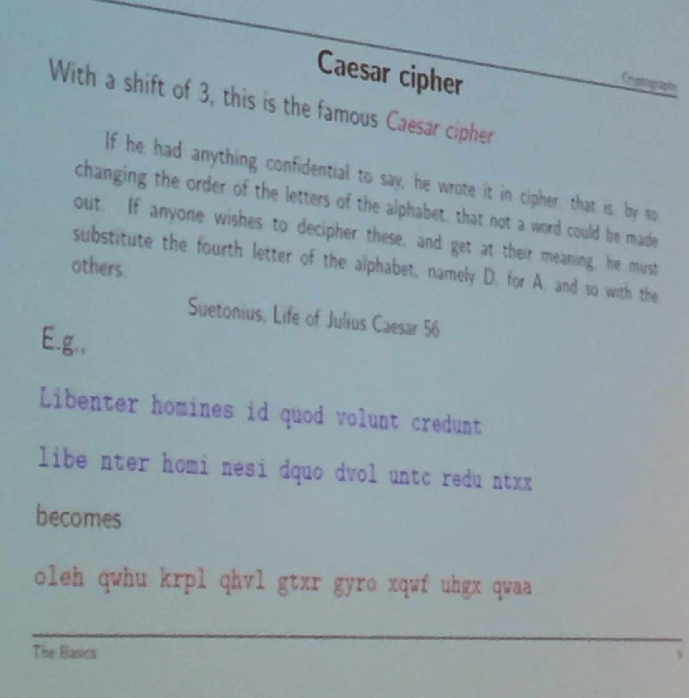
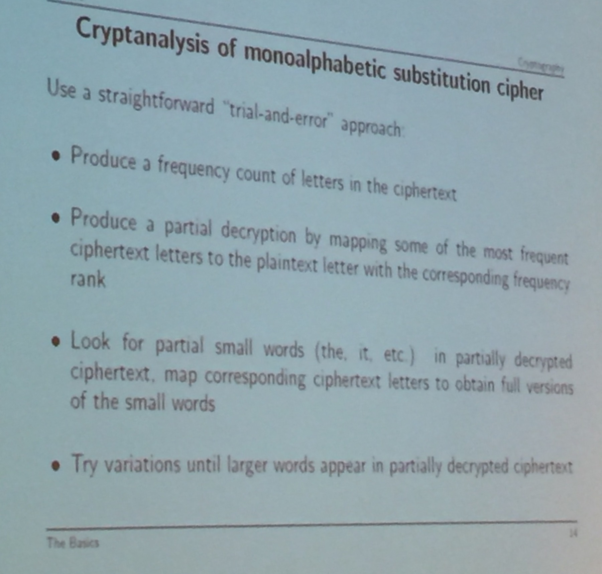
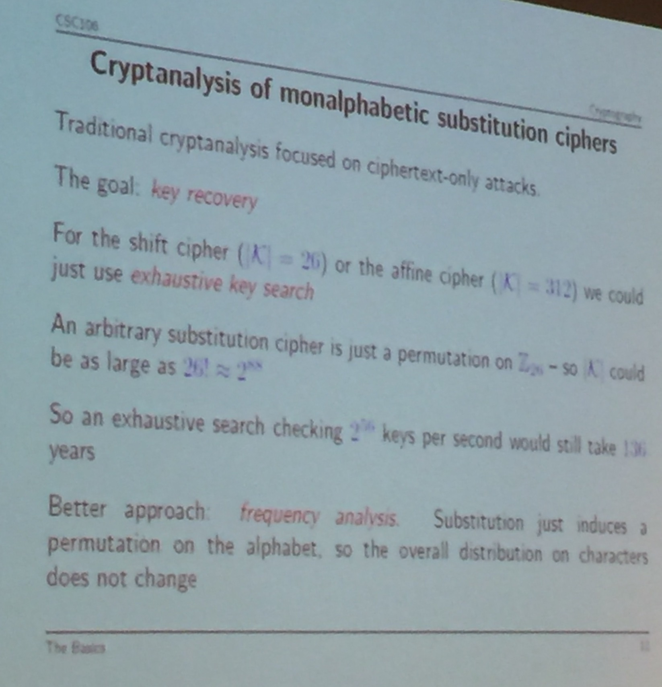

## Lecture 21 - March 1st, 2017

### Guest Lecturer - Bruce Kapron

#### What is Cryptography?

Cryptography refers to a set of mathematical and algorithmic tools designed to provide security properties

* Secrecy
* Integrity
* Authenticity
* Non-repudiation

**Cryptology:**

* -> Cryptography
* -> Cryptanalysis
    
#### Why is this relevant in CS?

* An important aspect of security for computing and communication systems
* Enabling new tech / apps (cryptocurrencies, e-voting)
* Many CS-related tools, techniques and algorithms relevant to building cryptographic systems, and breaking them (cryptanalysis)

#### What will we do today?

* Focus on encrytion (secrecy)
* Some history
* Modern approaches to private-key encryption 
* The public-key revolution

#### Crytography vs Security

Bruce Schneir's Article:

* ["Security pitfalls in crypto"](http://www.counterpane.com/pitfalls.html)

#### Private-key Cryptography

Until 1970's all cryptography was private-key (based on a single key shared by communication parties.)

**Symmetric Crypto:** Same for encrypt and decrypt

Here, m is the message or plaintect, c is ciphertext, and k is key

**Classical Crypto:**

* **Substitution ciphers**
    * Plaintext letters are replaced by ciphertext letters
    * Monoalphabetic subsitituion is mapped to a unique corresponding
    * Polyalphebetic 
* **Transposition ciphers**
* **Shift cipher**
* **Ceasar cipher**
* **Affine cipher**
* **General substitution cipher**
* **Vigenère cipher**
    * Developed by Giovan Battista Bellaso and popularised by Blaise de Vigenère 
    * Formal Definition:
* **Kasiski's Method**
* **Frequency analysis:** A Tool
    * Determines the letter frequencies 
        * Ex. Santa Cruz Public Library Chart
* **Attack Models**
    * Known plaintext -> General Starter Message
        * EX. Hello, Dear Miss...
    * Chosen plaintext -> know some plaintext 
        * EX. Battle of Midway - May 1942
            * Japanese Navy (2 Level Code)
            * US Naval Intelligence (Bolean level 1)
                * Japan figured out the code, but didn't know what AF was
                    * Water shortage on midway
                    * Water shortage on AF
                    

