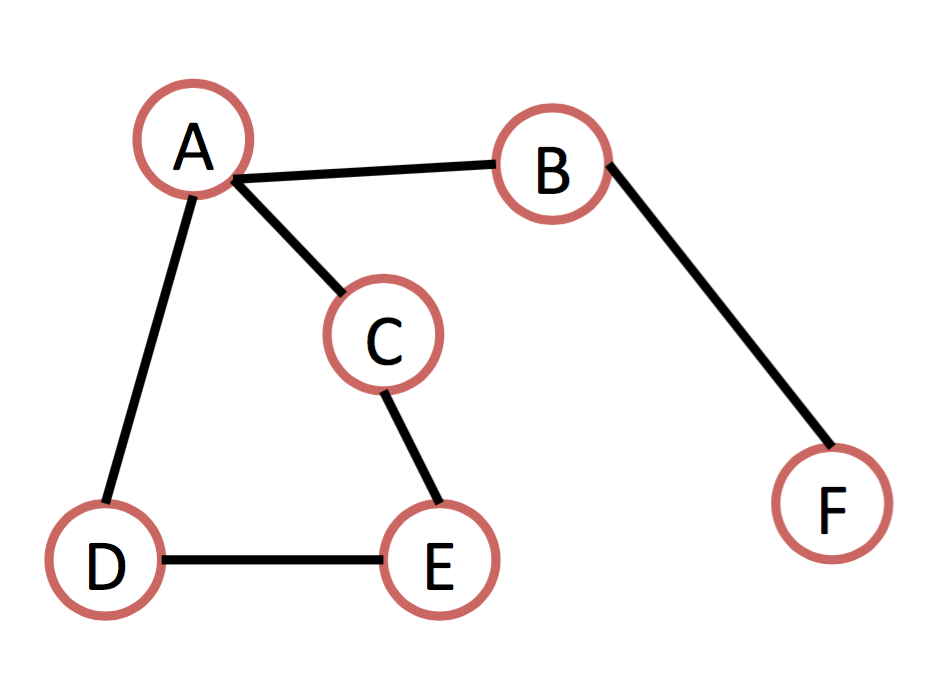

## Lecture 24 - March 14th, 2017

### Graph Algorithms

#### What is a graph?

* A graph is a mathematical tool used to represent a structured system
* It is made up of
    * Node or Vertices (circles)
    * Edges (lines)

* Graphs can have
    * Paths
        * There is a path from A to F 
    * Cycles
        * A path that loops back on itself
* Nodes can have
    * Neighbours
        * Connected via edge

* Graphs are useful for representing multiple real world problems
    * Social networks 
    * Internet
    * Power grids
* Google's Page rank algorithm uses a graph that represents the entire internet, and the links between pages. 

* Some graphs are trees
    * A graph is a tree if it contains no cycles

#### Graph Algorithms

* Searching: visit all node of a graph
    *  Breadth first search (BFS)
        * Use a queue
    * Depth first search (DFS)
        * Use a stack    

#### Queue vs stack

* Queue 
    * Like a line at the grocery store
        * First in first out (FIFO) 
* Stack
    * Like a stack of waffles
        * First in last out (FILO) 

#### Depth first search

* Put start a node in stack, add to result, mark it as visited
* While stack is not empty
    * Look at node at top of stack, call it V
    * If V has unvisited neighbours:
        * Select alphabeticallyy next unvisited neighbour, call it U
            * Add U to reseult
            * Mark U as visited
            * add U to stack
        * Else remove V from stack

**Example:** 

             
Stack -D- -> -E- -> -C- -> -F- -> -B- -> -A-

Result: A B F C E D

Visited: -A- -B- -C- -D- -E- -F-

#### Breadth First Search

* Put start node in queue, add to result, mark as visited
* While queue is not empty:
    * Remove first node from queue, call it V, the current working node
    * For all neighbors U of V, in alphabe2cal order:
        * If U is unvisited:
            * Add U to result
            * Mark U as visited
            * Add U to queue

**Example:** 

Queue -A- -B- -C- -D- -F- -E-

Result A B C D F E

Visited -A- -B- -C- -D- -E- -F-

## Lecture 25 - March 15th, 2017

#### Dijkstra's Shortest Path Alg

* Given a graph with weighted edges
    * i.e. each edge has an associated number (weight)
* Find the shortest path from tart node "S" to every other node in the graph. 

* To start: distance from start S to self is 0, and previous node is N/A, all other distances ∞
* While there are no unprocessed nodes
    * Choose the unprocessed node U with smallest distance D to start node, break 2es with alphabe2cal order
    * For all neighbors V of U
        * If (best dist S -> V) > ( D + distance U->V)
            * Set best dist S -> V = (D + distance U->V)
            * Set prev node for V to U
    * Mark U as processed

**Example:** 

Current Vertex: 

| Vertex | Processed? | Best know distance | prev. vertex |
|--------|------------|--------------------|--------------|
| S      |            |                    |              |
| A      |            |                    |              |
| B      |            |                    |              |
| C      |            |                    |              |
| D      |            |                    |              |
| E      |            |                    |              |
| F      |            |                    |              |

[Video for Review](hdps://www.youtube.com/watch? v=8Ls1RqHCOPw)

* Each row in video corresponds to one of our tables
* Highligh2ng is the same as checking a row in col 2
* Col 3 and 4 are what get wriden in each col of a row in the video.
