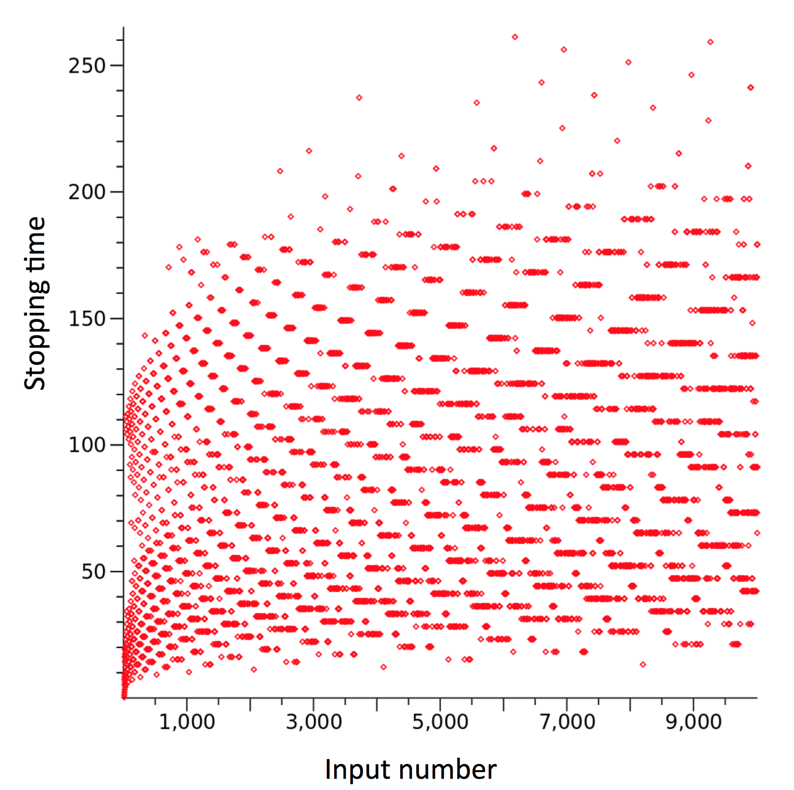

# Databases and Pseudocode

## Lecture 2 - January 6th, 2017 

* Motivating Example:
    * CSC 106 - Keeping Records of Grades
    * Goal: How to work with this Data
* Pseudocode -> Logic writing on your code.
* Algorithm -> Sets of steps

----

Table 1: 

| *stud_id*     | *stud_name*   | *course_name*| *crn*    | *prof_name*| *grade* |
| ------------- |:-------------:| ------------:|---------:|-----------:|--------:|
| 101           | Joe Smith     | CSC 106      | 23456    | Turing     | 80      |
| 111           | John Jackson  | CSC 106      | 23456    | Turing     | 45      |
| 145           | Al Green      | CSC 106      | 23456    | Turing     | 66      |
| 301           | Meg Lyon      | CSC 106      | 23457    | Jobs       | 79      |
| 200           | Jane McKenzie | CSC 106      | 23457    | Jobs       | 83      |

**Solution For:** The above question

```pseudocode
total = 0
count = 0
i = 1

while i =< total # rows in table
    total = total + grade in row i
    count = count + 1
    i = i + 1

average = total / count
```

**Solution For:** Keeping track of grades for a specific teacher

```pseudocode
total = 0
count = 0 
i = 1

while i =< total # rows in table
    if prof-name of row i = Turing
        total = toal + grade in row i
        count = count + 1
    i = i + 1

average = total / count
```

**Solution For:** Inserting a new grade in the table

Before:

```pseudocode
i = # rows in table + 1

stud_id for row i = 313
stud_name for row i = Steve Cook
course_name for row i = CSC 106 (Too much info)
CRN for row i = 23456
prof-name for row i = Turing (Too much info - CRN is all mighty)
grade for row i = 91
```

After:

```pseudocode
i = # rows in grades table + 1

stud_id for row i = 313
stud_name for row i = Steve Cook
CRN for row i = 23456
grade for row i = 91
```

---

**NOTE:** The question now has two tables to work with instead of one.

Table 1: Courses

| *course*	| *crn* | *prof_name*  |
| ---------:| -----:| ------------:|
| CSC 106   | 23456 | Turing       |
| CSC 106   | 23457 | Jobs         |

Table 2: Grades

| *stud_id*     | *stud_name*       | *crn*    | *grade* |
| -------------:| -----------------:| --------:| -------:|
| 101           | Joe Smith         | 23456    | 80      |
| 111           | John Jackson      | 23456    | 45      |
| 145           | Al Green          | 23456    | 66      |
| 301           | Meg Lyon          | 23457    | 79      |
| 200           | Jane McKenzie     | 23457    | 83      |

---

**Solution For:** Calculating the average for students in class with CRN 23457

```pseudocode
total = 0
count = 0
i = 1

while i =< total # of rows in grades tables
    if crn in row i is 23457
        total = total + grade in row i
        count = count + 1
    i + i + 1
average = total / count
```

**Solution For:** Calculating a better average

```pseudocode
if  count = 0 
    average = 0
else 
    average = total/count
```

**Solution For:** Table Case: Inserting a new grade into two tables

```pseudocode
if input crn is not in classes table 
    return error
else 
    stud_id for row i = 313
    stud_name = Steve Cook
    crn = 23456
    grade = 91
```

**Solution For:** Calculating the average grade for classes that Turing teaches

```pseudocode
total = 0 
count = 0
j = 1 (Index into classes table)

while j =< # rows in classes table 
    if row j of classes tables has prof_name = Turing
        my_crn = crn in j of classes table

        i = 1
        while i =< #rows in grades table
            if crn for row i of grades table  = my_crn
                table = total + grade in row i of grades table
                count = count + 1
            i = i + 1
    j = j + 1
```

## Lecture 3 - January 10th, 2017

### Trace Through Code

Code:

```pseudocode
Step1 - total=0
Step2 - count=0
Step3 - i=1
Step4 - while i <= # rows in table, repeat steps 5 through 8
Step5 - 	if prof_name of row i equals Turing, do line 6 and 7 
Step6 - 		total = total + grade in row i
Step7 - 		count = count + 1
Step8 -		i=i+1
Step9 - average = total / count
```

Table 1:

| *stud_id*     | *stud_name*   | *course_name*| *crn*    | *prof_name*| *grade* |
| ------------- |:-------------:| ------------:|---------:|-----------:|--------:|
| 111           | John Jackson  | CSC 106      | 23456    | Turing     | 45      |
| 200           | Jane McKenzie | CSC 106      | 23457    | Jobs       | 83      |
| 342           | Patricia Dune | CSC 106      | 23456    | Turing     | 94      |
| 301           | Meg Lyon      | CSC 106      | 23457    | Jobs       | 79      |

*Solution:*

```pseudocode
#rows = 4

total=0
count=0
i=1
--
total=45
count=1
1=2
--
i=3
--
total=139
count=2
i=4
--
i=5
-- 
Average = 139/2 = 69.5
```

### Write pseudocode that calculates the maximum grade for a student in class with crn = 23456

### Trace Through Code

Code:

```pseudocode
Step1 - max=-1
Step2 - i=1
Step3 - while i <= # rows in table, repeat steps 4 through 7
Step4 - 	if crn of row i equals 23456, do line 5 and 6 
Step5 - 		if max < grade in row i do line 6
Step6 - 			max = grade in row i 
Step7 - 	i=i+1
```

Table:

| *stud_id*     | *stud_name*   | *course_name*| *crn*    |*prof_name*|*grade*|
| ------------- |:-------------:| ------------:|---------:|----------:|------:|
| 111           | John Jackson  | CSC 106      | 23456    | Turing    | 45    |
| 200           | Jane McKenzie | CSC 106      | 23457    | Jobs      | 83    |
| 342           | Patricia Dune | CSC 106      | 23456    | Turing    | 94    |
| 301           | Meg Lyon      | CSC 106      | 23457    | Jobs      | 79    |

**Solution:** 

```pseudocode
max=-1
i=1
--
max=45
i=2
--
i=3
--
max=94
i=4
--
i=5
```

### SQL
Sql is a structured query language.

### Database
A database is a collection of tables.

**Install SqLite3**

```bash
brew install sqlite
```

**Start by making a blank table:**

```sql
create table grades( stud_id int, stud_name text, course_name text, crn int, prof_name text, grade int);
```

**Note:** Order of values must match the order of the columns when you created the table.

### Query 
A query is a select statement that tells the computer what columms the result should have. 

Ex.

```sql
Select stud_name, grade 
from grades;
```

Returns --> Table 1: Grades

| *stud_name*	| *grade*	|
| -------------:| ---------:|
| name          | 56        |
| name          | 78        |

Ex. 

```sql
Select avg(grade)
From grades;
```

Returns --> Table 1: Average

| *avg(grade)* |
| ------------:|
| 72.8         |


Ex.

```sql
select max(grade)
from grades;
```

Returns --> Table 1: Max

| *max* |
| :----:|
| 94    |

Ex.

```sql
Select stud_name, grade, crn 
from grades
where crn = 23456;
``` 

Returns --> Table 1: Grades

| *stud_name*  | *grade*   |  *crn* |
| ------------:| ---------:| ------:|
| Joe Smith    |        80 |   23456|
| John Jacks   |        45 |   23456|
| Al Green     |	    66 |   23456|
| Greg Black   |        60 |   23456|
| Patricia D   |        94 |   23456|

Ex. 

```sql
Select stud_name, grade 
from grades
where prof_name = “Jobs”;
```

**Note:** text must be surrended by quotes. 

Returns --> Table 1: Grades

| *stud_name*  | *grade*|
| ------------:| ------:|
| Meg Lyon     |   79   |
| Jane McKen   |   83   |
| Richard Fe   |   70   |
| Paul Shelb   |   66   |
| John Jacks   |   85   |

---

#### You should know 

* How to step through pseudocode
* How to write some simple SQL queries using: –  avg, max, where


## Lecture 4 - January 11th, 2017

`Select *` is shorthand for “select all of the columns of the table”. 

`*` can be viewed as a wild card. 

`select * from grades where crn = 23456 and grade > 50;`

`select count(*)` will return the number of rows returned. (Important for assignment 1). 

`select * from grades order by stud_name;` will order the entries.

`select * from grades order by grade desc;` will sort by descending order.

**Question:** Create a list of student names for Turing’s class, ordered by name?

`select stud_name from grades where prof_name = Turing order by stud_name;`

#### You should know 

* How to step through pseudocode
* How to write some simple SQL queries using:
	* avg
	* max
	* where
	* select * 
	* select count(*)
	* order by


### More Pseudocode Practice

**Question:**  Write a query to print phone number of a person if it exists in the table

`input: name_in` holds the name we look for

| *name*  |    *number*|
| -------:|-----------:|
| Joe     |    472-5700|
| Leo     |    472-5702|
| Sara    |    472-5701|

```pseudocode
Step1 i=1
Step2 found=NO
Step3 while i =< #rows in table do Step4-7
Step4 	if name in row i is name_in do Step5&6
Step5 		print number in row i
Step6 		found=YES
Step7 	i= i+1
Step8 if found = NO do Step9
Step9 	print "no such person in directory."
```

Inefficiency, if you find the name and it's the first one in the table, the while loop will still run. 

```pseudocode
Step1 i=1
Step2 found=NO
Step3 while i =< #rows in table AND found = NO do Step4-7
Step4 	if name in row i is name_in do Step5&6
Step5 		print number in row i
Step6 		found=YES
Step7 	i= i+1
Step8 if found = NO do Step9
Step9 	print "no such person in directory."
```

Execution: 

```pseudocode
name_in = "Leo"
i=1
found = NO
rows# = 3
--
i = 2
--
472-5702
found = YES

i = 3
--
Exit while loop
```

`select number from phone_numbers where name = "Leo";` - will be the query.


### Collatz Conjecture

1. Pick a number.
    * If it’s even, divide by two 
    * If odd multiply by three and add one 
2. Repeat
3. Stop if the number is 1

**Question:** Write this in Pseudocode 

Bonus: Of Interest

*  No one knows if there’s a number for which the collatz conjecture will not terminate
*  Has been checked for all numbers up to 260 –  All of which do terminate at 1

```pseudocode
inpurt num+in (number to test)
if num_in < 1
	print "error, bad number" Exit 

cur_num = num_in
	while cur_num is not 1
    	if cur_num is even do 
        	divide by 2
        else if cur_num is odd do 
        	cur_num X 3 + 1
```

```
num_in = 4
cur_num = 4

cur_num = 2

cur_num = 1

Exit while loop
--
num_in = 5
cur_num = 5

cur_num = 16

cur_num = 8

cur_num = 4

cur_num = 2

cur_num = 1

Exit while loop
```


