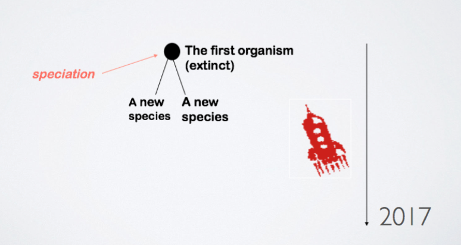
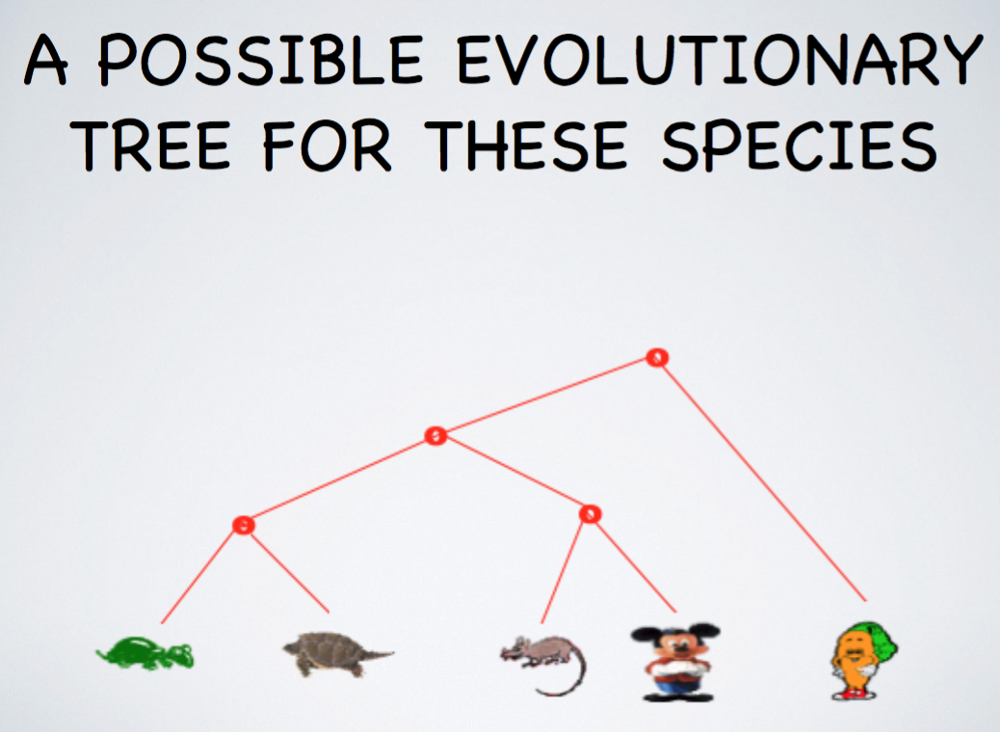
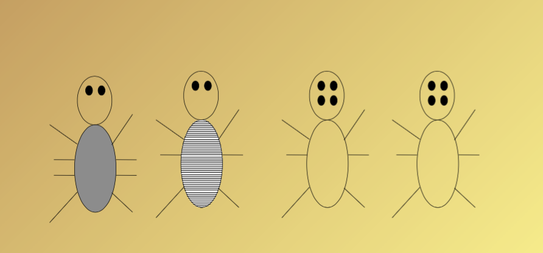

## Lecture 27 - March 22nd, 2017

### Guest Lecture
by Prof. Ulrike Stege

#### Some bioinformatics / Computational Biology: An algorithm to Build Evolutionary Trees

* What is bioinformatics / computational biology?
    * An Interdiscipline field addressig bio
* Origin of species
* What does the tree of life look like?
* Sequencing of species/organismsn/viruses
* What evolutionary events do exist? When and how often did or do ther occur?

#### Evolutionary Trees (An Other Application of Graphs)

How did life evolve?

#### Determining Evolutionary Trees Today

* Of course, today we do not use looks only, rather consider more informative data such as the organisms's DNA sequences
* In addition, we might want to use other properties or characteristics known
* Today, we look at an algotritm that uses any type....

#### REMARK: trees are a special type of graphs (graphs without cycles)

* Acyclic graphs
* Consists of two types of vertices/nodes: 
    * External vertices (leaves)
    * Internal vertices

#### Bug mutation: How did these bugs evolve???

What did the ancestors of these bugs look like???

**Goal:** given an evolutionary "tree skeleton" for several orgnisms, determine the evolutionary change necesary to explain the evolution of the organisms. 

We call this problem the small parsimony problem

**Parsimonious:** adj. unwilling to spend money or use resources: stingy of frugal.

 

#### Occam's Razors

In science, we often follow the principle of Occam's Razor:

When competing hypotheses are equal in other respects, the Occam's razor principle recommends the selection of a hypothesis that introduces fewest assumptions while still sufficiently answering the question. 

##### Find most parsimonious ancetors for this tree topology!!

#### Fitch's Algorithm (Walter fitch)

* Step 1: Do a postorder traversal of the tree and at the same time label every node in the tree with a set of possible best features. 
* Step 2: Do a preorder taversal of the tree and at the same time label every node in the tree with a set of possible best feautres. 

* Traverse tree in postorder
    * Leaves:
        * Label with the organism's features
    * Ancestors:
        * If the features of children intersect, label with intersection { this is the set of best features}
        * Else label with union of children's features {any feature in union could be ok}
* Traverse tree in preorder
    * Root:
        * Pick any labelled feature arbitrarily
    * Others:
        * Pick label that matches parent feature
        * If none, pick any arbitrarily else label with union of children's features     

#### Parsimony Problems


* Small Parsimony problem (as above)
    * Tree topology is known
    * Goal: How many evolutionary changes did occur?
    * Solvable in polynomial time (e.g., Fitch’s algorithm) 
* Large Parsimony problem
    * Tree topology is unknown
    * Goal: Find Most Parsimonious Tree
    * For this problem no efficient algorithm is known (the problem is shown to b NP-complete)

--

P = NP?

ECS 504 (ustege@uvic.ca)
