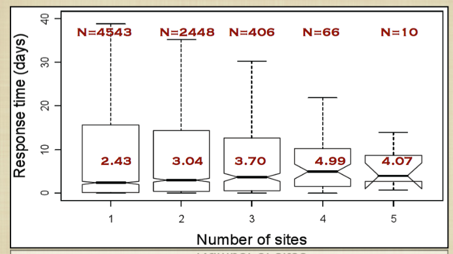
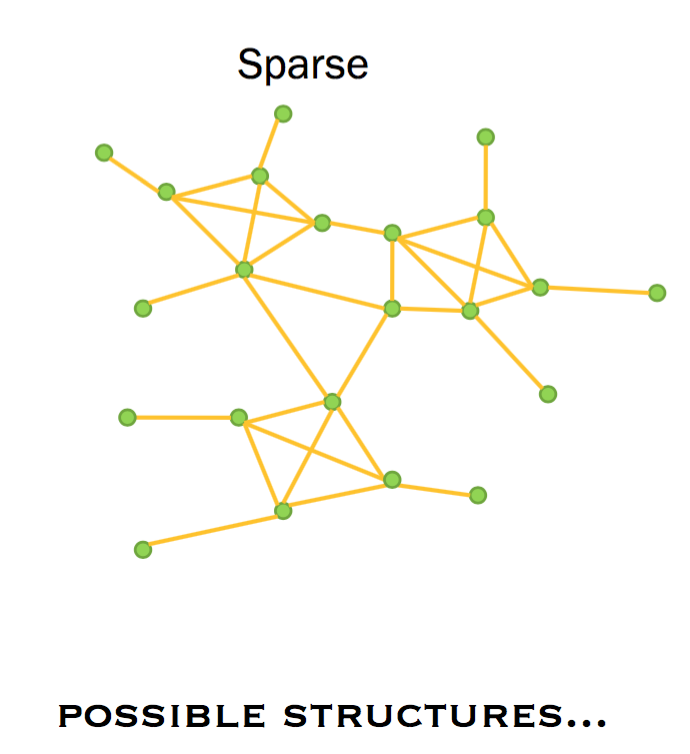
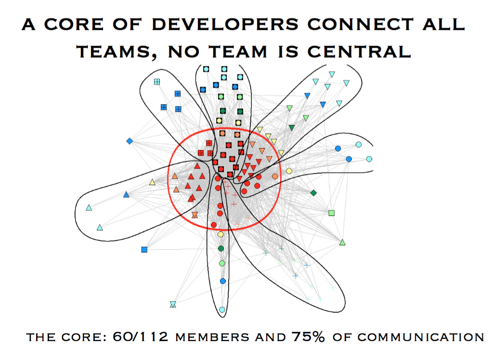

## Lecture 30 - March 29th, 2017

### Guest Lecture
by Prof. Daniela Damian

#### The human Factor: The Influence of Process, Tools and oOrganizational Structures on Developer Collaboration

[Link to Website](thesegalgroup.org)

#### The software Engineering Global interAction Lab

* Projects
    * Coordination in large global software teams
    * Requirements Engineering: Collaboration, Process Improvement and Runtime Self-adaptivity
    * Awareness tools for distributed coordination
* Expertise
    * Empirical studies of developers
    * Data mining of large software repositories
    * Social network analysis
* Industrial partnerships
    * IBM, Dell, Siemens, GM

#### Distrubuted communication and Delay

Does distance imply delay?

* Delay in communication and issue resolution
* Communication: Response time on issue communication

Repo -> Communication / Issue

Delay in Communication -> Response Time

#### Focusing on performance: 
Does communication matter?

#### Which graph is best?

#### Focusing on Performance: 

#### Discovering Requirements at Runtime in Unpredictable Environments

Worked with a team of 4 rowers Crossing the Atlantic Ocean
Developed data mining techniques to discover patterns in usage and context

Rowers --> 4hours interval 

They required a scheduler to tell them what to do.
